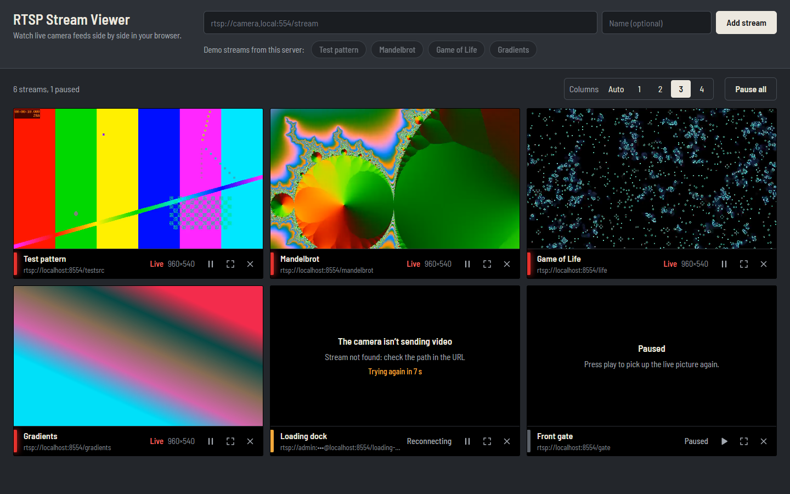
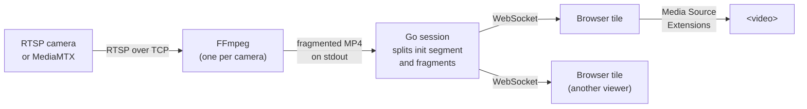

# RTSP Stream Viewer

[](https://github.com/mohitpal2621/rtsp-stream-viewer/actions/workflows/ci.yml)

A web app for watching RTSP camera streams in the browser. You paste RTSP URLs, and each stream plays live in a grid with its own play/pause, full-screen and remove controls. A Go backend pulls each stream with FFmpeg and relays it to the browser over a WebSocket, where Media Source Extensions play it.

Stack: Go 1.23 backend, React 19 + TypeScript frontend (Vite), FFmpeg, MediaMTX for the test streams.



**Live demo:** https://rtsp-stream-viewer-5p4t.onrender.com

No login is needed. The demo runs on Render's free plan, which puts the server to sleep after 15 idle minutes, so the first visit can take up to a minute while it starts. The demo stream buttons under the URL box add looping test streams served from the same container, so you can try it without a camera.

## Running it locally

### With Docker

```bash
docker compose up --build
```

Open http://localhost:8080 and click one of the demo streams. The same image is what runs on Render: the Go server, the built frontend and a MediaMTX instance with four looping test streams. The demo RTSP streams are also published on port 8554, so you can open `rtsp://localhost:8554/testsrc` in VLC to compare.

### Without Docker

You need Go 1.23+, Node 22+, FFmpeg 4.4 or newer on your `PATH` and [MediaMTX](https://github.com/bluenviron/mediamtx/releases).

1. Start MediaMTX with its default config and publish a test stream to it:

   ```bash
   ./mediamtx
   ```

   ```bash
   ffmpeg -re -f lavfi -i testsrc2=size=1280x720:rate=25 -c:v libx264 -preset veryfast -tune zerolatency -g 25 -bf 0 -pix_fmt yuv420p -f rtsp -rtsp_transport tcp rtsp://localhost:8554/test
   ```

   Run the FFmpeg command again with a different path (`/test2`, `/test3`) for more streams.

2. Start the backend on port 8080:

   ```bash
   cd backend
   go run ./cmd/server
   ```

3. Start the frontend dev server, which forwards `/api` to the backend:

   ```bash
   cd frontend
   npm install
   npm run dev
   ```

4. Open http://localhost:5173 and add `rtsp://localhost:8554/test`.

To get the demo stream buttons locally, set `DEMO_STREAMS` before starting the backend, for example `DEMO_STREAMS="Test=rtsp://localhost:8554/test"`.

## How it works



1. When a tile starts, the browser sends the RTSP URL to `POST /api/streams`. The server validates it and returns a stream ID, an HMAC of the URL with a key the server picks at startup. The same URL gets the same ID, so every viewer of a camera shares one session, but nobody can work out an ID without knowing the URL. The browser registers the URL again every time it connects, so a server restart doesn't break anything.
2. The browser opens `GET /api/streams/{id}/ws`. The first viewer starts FFmpeg for that session.
3. FFmpeg reads the camera and writes fragmented MP4 to its stdout. For H.264 cameras it copies the video without re-encoding (`-c:v copy`), and it starts a new fragment at every keyframe (`-movflags frag_keyframe+empty_moov`).
4. The Go session reads MP4 boxes from the pipe. It keeps the initialisation segment (`ftyp` + `moov`) and sends each `moof` + `mdat` fragment to every connected viewer.
5. The browser creates a `MediaSource`, appends the init segment and then the fragments to a `SourceBuffer`, and the `<video>` element plays them. The player keeps playback about 1.5 fragments behind the newest video, which is close to live without stalling between fragments.

Each WebSocket carries JSON text messages for control and binary messages for video:

| Message | Meaning |
| --- | --- |
| `{"type":"status","state":"connecting"}` | FFmpeg is starting or waiting for the camera |
| `{"type":"init","mime":"video/mp4; codecs=\"avc1.4d401f\""}` | The next binary message is an init segment; start a new `MediaSource` with this codec |
| `{"type":"status","state":"live"}` | Fragments are flowing |
| `{"type":"status","state":"retrying","error":"...","retryIn":4}` | The camera failed; the server tries again in `retryIn` seconds |
| binary | An init segment or a media fragment |

### Why fragmented MP4 over WebSockets

The brief asks for FFmpeg and WebSockets. Within that, the common options are JPEG frames, MPEG-1 decoded in JavaScript (JSMpeg), or fragmented MP4 played with Media Source Extensions.

I went with fragmented MP4 because most IP cameras already send H.264, which FFmpeg can repackage without decoding it. On my machine a copying FFmpeg used about 1% of one CPU core and 24 MB of memory per stream, while transcoding to JPEG or MPEG-1 would need a full encoder per stream and lose quality. On the browser side, MSE hands H.264 to the hardware decoder, so a grid of streams plays at full frame rate.

The cost is latency. Each fragment holds one keyframe interval, so a viewer is at least one GOP behind the camera. With a keyframe every second, a test stream with the wall clock burned into the picture showed up about 1.2 seconds behind real time when I measured it locally. A camera with a 4-second GOP will be correspondingly further behind. See "Possible improvements" for how to reduce this.

## Error handling

| Situation | What happens |
| --- | --- |
| The URL is not `rtsp://` or `rtsps://`, or has no host | The form explains the problem before anything is sent; the API also rejects it with a 400 |
| The camera refuses the connection, the path doesn't exist, the password is wrong, the host doesn't resolve or the connection times out | FFmpeg's error output is turned into a short message such as "Stream not found: check the path in the URL". The server retries with exponential backoff from 1 to 30 seconds, and the tile shows the message and a countdown |
| The camera stops sending video but keeps the connection open | A watchdog restarts FFmpeg after 20 seconds without output |
| The camera sends H.265 or another codec browsers can't decode | The server reads the codec from the init segment and restarts FFmpeg in transcode mode, producing H.264 |
| A viewer's connection is too slow | That viewer skips whole fragments, which is safe because every fragment starts on a keyframe. Its queue never blocks the camera or other viewers. A viewer that can't even take a control message is disconnected and reconnects with a fresh init segment |
| The backend restarts or is unreachable | Each tile reconnects on its own with backoff (up to 10 seconds) and registers its URL again |
| The browser can't decode the stream at all | The tile says so and stops retrying |
| The browser's video buffer fills up | The player trims played video continuously, and if the buffer still fills it jumps to the newest video |

Every tile has a tally lamp in its label strip, as on a broadcast monitor: red when live, pulsing amber while connecting or retrying, grey when paused, and striped red when the stream can't be played.

## Performance with many streams

- One FFmpeg process per camera, however many people are watching it.
- FFmpeg runs only while someone is watching. Pausing a tile closes its WebSocket, and the server stops FFmpeg 20 seconds after the last viewer leaves.
- H.264 video is copied without re-encoding.
- The browser keeps about 6 seconds of played video per tile and trims the rest, so memory stays flat over long sessions.
- When a tile falls behind, for example after the tab was in the background, it plays at 1.1x speed to catch up, or jumps ahead if it is far behind.
- `MAX_STREAMS` caps how many FFmpeg processes one server will run, and every viewer queue is bounded.

### Scaling past one server

Sessions live in memory, so a single backend instance is the unit of scale. Running several behind a load balancer works if requests for the same stream ID go to the same instance, for example by hashing the `/api/streams/{id}` path. That keeps one FFmpeg per camera across the cluster. With many cameras and few viewers each, the instances can share load without coordination. For a large audience per camera, the next step would be an origin that pulls each camera once (MediaMTX can do this) with stateless relays in front of it.

## Configuration

The backend reads environment variables:

| Variable | Default | Description |
| --- | --- | --- |
| `PORT` | `8080` | HTTP port |
| `ALLOWED_ORIGINS` | (none) | Other browser origins allowed to call the API and open WebSockets, comma-separated, or `*` for any. Requests from the server's own origin are always allowed |
| `FFMPEG_PATH` | `ffmpeg` | FFmpeg binary |
| `RTSP_TRANSPORT` | `tcp` | `tcp` or `udp` for pulling RTSP |
| `IDLE_TIMEOUT` | `20s` | How long FFmpeg keeps running after the last viewer leaves |
| `STALL_TIMEOUT` | `20s` | Restart FFmpeg if it produces no output for this long |
| `MAX_STREAMS` | `16` | Maximum concurrent streams (FFmpeg processes) |
| `STATIC_DIR` | (none) | Serve the built frontend from this directory |
| `DEMO_STREAMS` | (none) | Streams offered as one-click buttons, as `Name=rtsp://...,Other=rtsp://...` |
| `LOG_LEVEL` | `info` | `debug`, `info`, `warn` or `error` |

In the Docker image, `DEMO_SOURCES=off` skips starting MediaMTX and the demo streams.

The frontend reads `VITE_API_URL` at build time. Leave it unset when the backend serves the frontend or in development. Set it to the backend's URL when the frontend is hosted separately.

## API

| Method and path | Description |
| --- | --- |
| `POST /api/streams` | Body `{"url": "rtsp://..."}`. Returns `{"id": "..."}`, or `{"error": "..."}` with 400 for an invalid URL and 503 when the server is at `MAX_STREAMS` |
| `GET /api/streams/{id}/ws` | WebSocket carrying the stream, as described above |
| `GET /api/streams` | Active sessions with state, viewer count and codec. IDs and URLs are left out, so the list can't be used to open someone else's camera |
| `GET /api/config` | Demo streams for the UI |
| `GET /healthz` | Health check |

## Project layout

```
backend/
  cmd/server/          entry point: config, wiring, graceful shutdown
  internal/stream/     FFmpeg runner, MP4 box splitter, sessions and fan-out, URL validation
  internal/api/        HTTP routes, WebSocket handler, CORS, static files
  internal/config/     environment variables
frontend/
  src/player/          StreamPlayer (WebSocket + MSE) and the live-edge logic
  src/components/      the grid, tiles, add form and toolbar
  src/hooks/           the saved stream list
  src/lib/             API client and URL helpers
demo/                  MediaMTX config, clip generator and container entrypoint
scripts/smoke-test.mjs end-to-end check against a running server
Dockerfile             all-in-one image used by Docker Compose and Render
render.yaml            Render Blueprint
```

## Tests

```bash
cd backend && go test ./...
cd frontend && npm test
node scripts/smoke-test.mjs http://localhost:8080
```

The Go tests cover MP4 parsing against real FFmpeg output (H.264 and HEVC fixtures in `testdata`), FFmpeg error messages, the session lifecycle with a fake source (fan-out, late joiners, idle shutdown, retries, the switch to transcoding, slow viewers), URL validation, config parsing and the HTTP and WebSocket API. The frontend tests cover the live-edge decisions, URL helpers and loading the saved list. The smoke test registers a demo stream on a running server and waits for an init segment and three fragments over the WebSocket.

GitHub Actions runs the Go tests with the race detector and the frontend lint, tests and build. It then builds the Docker image, starts it and runs the smoke test against the container.

## Deploying

The live demo is one Docker web service on Render, described in `render.yaml`. To deploy your own copy, create a Blueprint in the Render dashboard (New, then Blueprint), pick this repository and apply it. Render builds the Dockerfile, sets `PORT`, and checks `/healthz`.

To host the frontend separately, for example on Vercel, use `frontend` as the root directory, `npm run build` as the build command and `dist` as the output directory, and set `VITE_API_URL` to the backend's URL. Then set `ALLOWED_ORIGINS` on the backend to the frontend's URL. The backend itself needs a host that allows long-running processes and WebSockets, which rules out Vercel's serverless functions.

## Limitations

- Video only. Audio is dropped, because cameras often send G.711, which browsers can't play from MP4.
- Latency is at least one keyframe interval of the camera, as explained above.
- On iPhone, playback needs iOS 17.1 or later, which added `ManagedMediaSource`.
- There is no authentication, and the server connects to any RTSP URL a visitor enters, including addresses on its own network. Watching a stream requires knowing its URL, but a real deployment would need login and an allowlist of camera hosts.
- The list of streams is stored in the browser, so it doesn't follow you to another device.

## Possible improvements

- Lower latency: ask FFmpeg for shorter fragments with `-frag_duration`, mark which fragments start with a keyframe, and have new viewers join at the next keyframe fragment.
- Audio, by transcoding it to AAC.
- Snapshots and recording, by adding a second FFmpeg output.
- Metrics (active streams, viewers, restarts, bytes sent) for monitoring.
